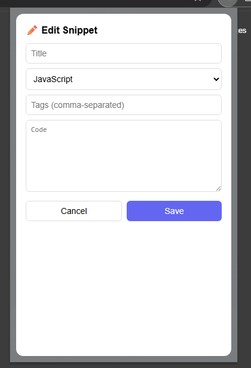

# SnipVault - Code Snippet Saver Chrome Extension

## 🚀 Project Overview

SnipVault is a powerful Chrome extension designed for developers to save, manage, and organize code snippets with syntax highlighting. It provides an intuitive interface for capturing code from web pages and managing your personal snippet library.

## ✨ Key Features

- **Right-click Context Menu**: Save highlighted text as snippets directly from any webpage
- **Syntax Highlighting**: Powered by Prism.js for beautiful code presentation
- **Smart Search & Filter**: Find snippets by title, language, or tags
- **One-click Copy**: Copy snippets to clipboard instantly
- **Full CRUD Operations**: Create, read, update, and delete snippets
- **Tag Management**: Organize snippets with custom tags
- **Import/Export**: Backup and restore your snippet collection as JSON
- **Multi-language Support**: Supports JavaScript, Python, HTML, CSS, Java, C++, PHP, Ruby, Go, Rust, and more

## 📸 Application Screenshots

### Main Popup Interface

*The main popup showing saved snippets with syntax highlighting and management options*

### Manual Snippet Addition

*Dialog for manually adding new code snippets with language selection*

### Edit Functionality

*Edit interface allowing users to modify existing snippets*

### Copy Confirmation

*Success notification when snippet is copied to clipboard*

### Update Confirmation

*Confirmation message after successfully updating a snippet*

### Options Page

*Advanced options page for tag management and import/export functionality*

## 🏗️ Technical Architecture

### Core Components

- **Manifest V3**: Modern Chrome extension architecture
- **Service Worker**: Background script for context menu and initialization
- **Content Script**: Handles text selection and user interactions
- **Popup Interface**: Main UI for snippet management
- **Options Page**: Advanced configuration and data management

### File Structure

```
code-snippet-saver/
├── manifest.json          # Extension configuration
├── background.js          # Service worker for context menu
├── content.js            # Content script for text selection
├── popup/               # Main popup interface
│   ├── popup.html
│   ├── popup.js
│   └── popup.css
├── options/             # Options page
│   ├── options.html
│   └── options.js
├── libs/               # External libraries
│   ├── prism.js       # Syntax highlighting
│   └── prism.css
└── icons/             # Extension icons
```

## 🛠️ Technologies Used

- **JavaScript ES6+**: Core functionality
- **HTML5 & CSS3**: User interface
- **Prism.js**: Syntax highlighting library
- **Chrome Extension APIs**: Storage, Context Menus, Active Tab, Scripting
- **JSON**: Data storage and import/export format

## 📦 Installation & Usage

1. Load the extension in Chrome Developer Mode
2. Highlight text on any webpage
3. Right-click and select "Save as Snippet"
4. Manage snippets through the popup interface
5. Use the options page for advanced features

## 🎯 Target Audience

- Web developers and programmers
- Students learning to code
- Technical writers and documentation creators
- Anyone who frequently works with code snippets

## 🔧 Development Status

**Version**: 1.0  
**Status**: Production Ready  
**Manifest Version**: 3 (Latest Chrome Extension Standard)

## 💼 Portfolio Value

**Technical Skills Demonstrated:**
- Chrome Extension Development (Manifest V3)
- JavaScript ES6+ and DOM Manipulation
- Browser APIs Integration (Storage, Context Menus, Scripting)
- UI/UX Design with responsive layouts
- Third-party library integration (Prism.js)
- Data persistence and management
- Import/Export functionality
- Cross-browser compatibility

**Development Practices:**
- Clean, modular code architecture
- User-centered design approach
- Production-ready extension with proper permissions
- Comprehensive feature set with CRUD operations
- Professional documentation and project structure

**Business Impact:**
- Solves real developer productivity challenges
- Demonstrates understanding of developer workflows
- Shows ability to create tools that enhance coding efficiency
- Market-ready product with practical applications

---

*SnipVault - Your personal code snippet vault, always at your fingertips.*