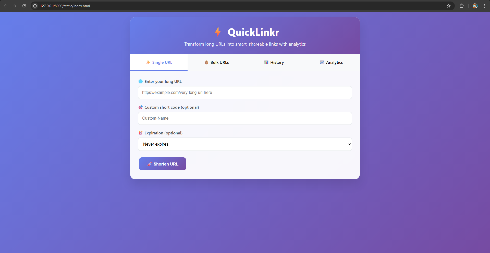

# QuickLinkr - URL Shortener Portfolio Project

> A modern, feature-rich URL shortener built with FastAPI showcasing full-stack development skills, analytics, and enterprise features.

## 🎯 Project Overview

QuickLinkr is a comprehensive URL shortening service that demonstrates advanced web development capabilities including real-time analytics, bulk processing, QR code generation, and a modern responsive interface.

## 🖼️ Application Screenshots

### Single URL Shortening Interface

*Clean, intuitive interface for shortening individual URLs with custom codes and expiration settings*

### Bulk URL Processing

*Efficient bulk processing supporting multiple URLs and CSV file uploads*

### URL History Management

*Comprehensive history view with QR codes, statistics, and management options*

### Analytics Dashboard

*Advanced analytics with visual charts, performance metrics, and detailed insights*

## 🚀 Key Features Demonstrated

### Technical Excellence
- **FastAPI Backend** - Modern async Python framework with automatic API documentation
- **SQLAlchemy ORM** - Robust database management with proper relationships
- **Pydantic Validation** - Type-safe data validation and serialization
- **RESTful API Design** - Clean, documented endpoints with Swagger UI

### Advanced Functionality
- **Custom Short Codes** - User-defined memorable links
- **QR Code Generation** - Automatic QR code creation for all URLs
- **URL Expiration** - Flexible expiration settings (1 day to 1 year)
- **Click Analytics** - Real-time tracking with detailed statistics
- **Bulk Operations** - CSV upload and batch processing capabilities

### User Experience
- **Responsive Design** - Mobile-first approach with modern gradients
- **Interactive Charts** - Visual analytics with bar charts and metrics
- **Toast Notifications** - User-friendly feedback system
- **Copy-to-Clipboard** - One-click URL copying functionality

## 🛠️ Technology Stack

| Layer | Technology | Purpose |
|-------|------------|---------|
| **Backend** | FastAPI + Uvicorn | High-performance async API server |
| **Database** | SQLite + SQLAlchemy | Lightweight database with ORM |
| **Validation** | Pydantic | Type-safe data validation |
| **QR Codes** | qrcode + PIL | Dynamic QR code generation |
| **HTTP Client** | httpx | Async URL validation |
| **Frontend** | HTML/CSS/JavaScript | Modern responsive interface |

## 📊 Database Architecture

```sql
-- URLs Table
CREATE TABLE urls (
    id INTEGER PRIMARY KEY,
    original TEXT NOT NULL,
    short TEXT UNIQUE NOT NULL,
    clicks INTEGER DEFAULT 0,
    created_at DATETIME DEFAULT CURRENT_TIMESTAMP,
    expires_at DATETIME
);

-- Click Logs Table
CREATE TABLE click_logs (
    id INTEGER PRIMARY KEY,
    url_id INTEGER REFERENCES urls(id),
    clicked_at DATETIME DEFAULT CURRENT_TIMESTAMP,
    user_agent TEXT,
    ip_address TEXT
);
```

## 🔧 API Endpoints

### Core Operations
```http
POST /shorten          # Create shortened URL
GET /{code}            # Redirect to original URL
GET /info/{code}       # Get URL statistics
POST /bulk-shorten     # Process multiple URLs
POST /bulk-upload      # CSV file upload
```

### Analytics & Management
```http
GET /api/analytics     # Dashboard data
GET /api/history       # Recent URLs
DELETE /api/history    # Clear history
```

## 💡 Problem-Solving Approach

### Challenges Addressed
1. **URL Validation** - Comprehensive validation for all URL formats
2. **Performance** - Efficient database queries with proper indexing
3. **User Experience** - Intuitive tabbed interface with real-time feedback
4. **Data Analytics** - Statistical calculations and visual representations
5. **Scalability** - Bulk processing for enterprise use cases

### Technical Decisions
- **SQLite for Development** - Lightweight, zero-configuration database
- **Async FastAPI** - High-performance concurrent request handling
- **Client-side Rendering** - Reduced server load with JavaScript interactions
- **Modular Architecture** - Separated concerns with clear file structure

## 🎨 Design Philosophy

- **Minimalist Interface** - Clean, distraction-free user experience
- **Progressive Enhancement** - Core functionality works without JavaScript
- **Mobile-First** - Responsive design for all device sizes
- **Visual Feedback** - Immediate user feedback with animations and notifications

## 📈 Performance Features

- **Efficient Queries** - Optimized database operations
- **Caching Strategy** - Reduced database hits for frequent operations
- **Async Operations** - Non-blocking I/O for better concurrency
- **Bulk Processing** - Handle hundreds of URLs simultaneously

## 🔒 Security Considerations

- **Input Validation** - Comprehensive URL and data sanitization
- **SQL Injection Prevention** - Parameterized queries with SQLAlchemy
- **XSS Protection** - Proper output encoding
- **Rate Limiting Ready** - Architecture supports rate limiting implementation

## 🚀 Deployment Ready

- **Environment Configuration** - Flexible settings for different environments
- **Docker Support** - Containerization ready
- **Production Optimizations** - Gunicorn + Uvicorn setup
- **Database Migration** - Automated schema updates

## 📋 Skills Demonstrated

### Backend Development
- RESTful API design and implementation
- Database modeling and optimization
- Async programming with Python
- Data validation and error handling

### Frontend Development
- Responsive web design
- JavaScript DOM manipulation
- AJAX requests and data handling
- User interface design principles

## 🎯 Portfolio Value

This project showcases:
- **Full-stack development** capabilities
- **Modern Python** frameworks and best practices
- **Database design** and optimization skills
- **API development** with comprehensive documentation
- **User experience** design and implementation
- **Problem-solving** approach to real-world challenges

---

*This project demonstrates production-ready code quality, modern development practices, and comprehensive feature implementation suitable for enterprise environments.*